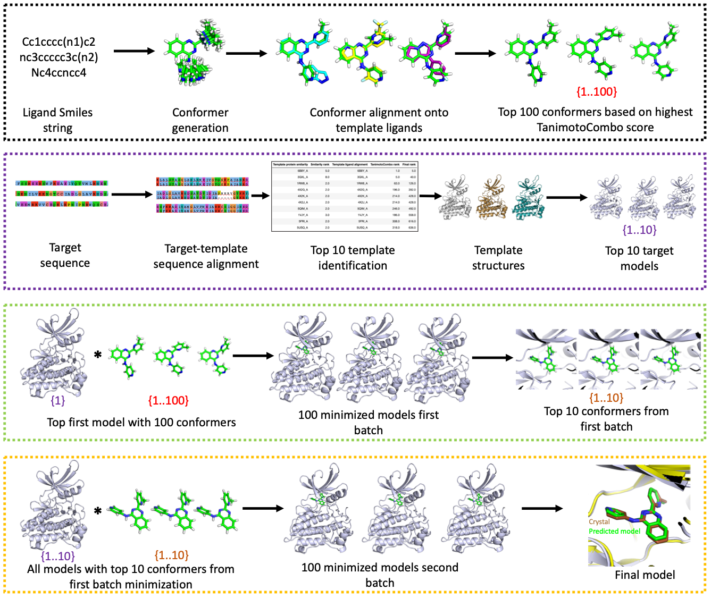

# Rosetta Kinase CM
This repository is for our project <b><i>Comparative Modeling Pipeline of Protein Kinase Inhibitors</i></b>. 


<figure class="image">
  
  <figcaption>Figure: Overview of Comparative Modeling Pipeline</figcaption>
</figure>

## Dependencies
* [Python 3.7](https://www.python.org/downloads/) (Pandas) 
* [Rosetta](https://www.rosettacommons.org/software/license-and-download) Software Suite 
* [PyRosetta](http://www.pyrosetta.org/) Software Suite
* [OpenEye](https://www.eyesopen.com/) Software Suite
* [EMBOSS](http://emboss.open-bio.org/html/use/ch02s07.html) Software Suite

```
2W1C_A_L0C
├── 2W1C_A.fasta
├── 2W1C_A_L0C.pdb
└── L0C.smi
```


The initial folder should contain three files and following the naming convention
- ```2W1C_A_L0C.fasta``` is the FASTA protein file for the kinase 2W1C
- ```2W1C_A_L0C.pdb``` is the PDB structure of 2W1C in complex with the L0C ligand or an empty file with the ```.pdb``` extension. 
- ```L0C.smi``` is the SMILES string for the L0C ligand


## 1. Conformer generation and ligand alignment with ```modeling_script.py```
* This script generates conformers, aligns conformers with a template, and selects the top 100 conformers for Rosetta minimization.

An example command is below:
```
/work/07424/gabeong/stampede2/anaconda3/bin/python /work/07424/gabeong/stampede2/rosetta_cm/Rosetta_Kinase_CM/modeling_script.py -f /work/07424/gabeong/stampede2/2W1C_A_L0C/ -omega /work/07424/gabeong/stampede2/openeye/bin/omega2 -rocs /work/07424/gabeong/stampede2/openeye/bin/rocs -temp_lig /work/07424/gabeong/stampede2/rosetta_cm/Rosetta_Kinase_CM/template_ligand_library -mol2params /work/07424/gabeong/stampede2/Rosetta/main/source/scripts/python/public/generic_potential/mol2genparams.py -convert /work/07424/gabeong/stampede2/rosetta_cm/Rosetta_Kinase_CM/convert.py
```
where
- ```/work/07424/gabeong/stampede2/anaconda3/bin/python``` is the filepath to the local python installation.
- ```/work/07424/gabeong/stampede2/rosetta_cm/Rosetta_Kinase_CM/modeling_script.py``` is the filepath to the modeling script.
- To ```-f``` add the filepath to the folder described above. 
- To ```-omega``` add the filepath to the local installation of OpenEye Omega.
- To ```-rocs``` add the filepath to the local installation of ROCS.
- To ```-temp_lig``` add the filepath to the template ligand library. 
- To ```-mol2params``` add the filepath to the ```mol2genparams.py``` script in Rosetta.
- To ```-convert``` add the filepath to the ```convert.py``` script in this repository. 

## Output folder should contain the following files after running  ```modeling_script.py```

```
2W1C_A_L0C
├── 2W1C_A.fasta
├── 2W1C_A_L0C.pdb
├── L0C.smi
├── OMEGA
│   ├── L0C_omega.log
│   ├── L0C_omega.parm
│   ├── L0C_omega.rpt
│   ├── L0C_omega.sdf
│   └── L0C_omega_status.txt
├── ROCS [7787 entries exceeds filelimit, not opening dir]
├── mol2params [200 entries exceeds filelimit, not opening dir]
└── top_100_conf [200 entries exceeds filelimit, not opening dir]
```

## 2. Sequence alignment and protein modeling with ```new_protein_modeling.py```
* This script conducts target-template sequence alignment, selects top templates, and minimizes the top 10 predicted models with PyRosetta.  
* Using the best model we concatenate the 100 conformers from the ligand alignment step, resulting in an unrefined protein-ligand complex of 100 comparative models.
```
/work/07424/gabeong/stampede2/anaconda3/bin/python /work/07424/gabeong/stampede2/rosetta_cm/Rosetta_Kinase_CM/modeling_script.py -f /work/07424/gabeong/stampede2/2W1C_A_L0C/ -emboss /work/07424/gabeong/stampede2/emboss/bin/needle -temp_seq /work/07424/gabeong/stampede2/rosetta_cm/Rosetta_Kinase_CM/template_fasta_seq_training_set -apo_pdb /work/07424/gabeong/stampede2/rosetta_cm/Rosetta_Kinase_CM/apo_pdbs_for_template_seq_extraction
```

## Output folder should contain the following files after running ```new_protein_modeling.py```
```
2W1C_A_L0C
├── 2W1C_A.fasta
├── 2W1C_A_L0C.pdb
├── L0C.smi
├── OMEGA
│   ├── L0C_omega.log
│   ├── L0C_omega.parm
│   ├── L0C_omega.rpt
│   ├── L0C_omega.sdf
│   └── L0C_omega_status.txt
├── ROCS [7787 entries exceeds filelimit, not opening dir]
├── mol2params [200 entries exceeds filelimit, not opening dir]
├── protein_comp_modeling [13 entries exceeds filelimit, not opening dir]
├── protein_ligand_complex_top_1_comp_model [100 entries exceeds filelimit, not opening dir]
└── top_100_conf [200 entries exceeds filelimit, not opening dir]
```

## 3. Minimization of protein-ligand complex (minimization.py)
* First, the input files for Rosetta minimization process will be generated for parallel computing.
* Second, once minimization finished, the energy for each model will be calculated similarly to the first step.
## 4. Analysis (analysis_1.py)
* Here, I will generate the table for 100 minimized structures. It contains the name and energy attributes of those models. Out of 100, the top 10 models will be selected using Rosetta energy values.
## 5. Complex modeling of remaining protein models (top_comp_prtn_lig_modeling.py) (from step 2, third point)
* Here, the PARAMS files of top 10 ligands will be taken from step 1, fifth point.
* Concatenation of protein-ligand complex (this will again result into 100 complex models) 
## 6. Minimization (top_comp_prtn_lig_modeling_minimization.py)
* The minimization process is same as step 3.
## 7. Analysis (analysis_2.py)
* The analysis process is same as step 4.
* The top 1 model will be reported as the best prediction. 

# Contact
Reach me at kirubanpk@gmail.com

# License
This project uses the following license: MIT License
